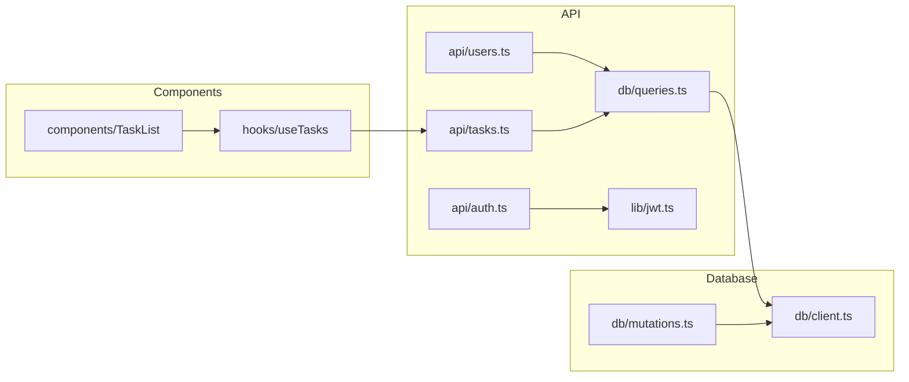
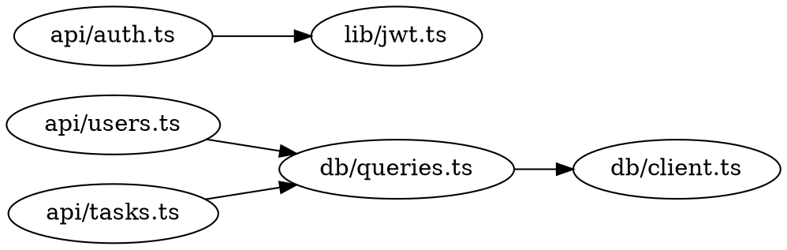

# Codebase Context Generator

## Purpose

Generate context files that help AI agents understand your codebase immediately, without spending tokens on exploration:

| File | Purpose | Format |
|------|---------|--------|
| `codebase-context.md` | Human-readable project overview | Markdown |
| `code-index.json` | Fast lookups for concepts, exports, types | JSON |
| `deps.mermaid` | Dependency graph for tracing imports | Mermaid |

## Quick Start

Run the extraction scripts to generate machine-readable context:

```bash
# Generate all context files (code-index.json, deps.mermaid, deps.json)
.claude/skills/codebase-context/scripts/generate-all.sh .

# Or run individually:
.claude/skills/codebase-context/scripts/generate-code-index.sh .
.claude/skills/codebase-context/scripts/generate-deps.sh . mermaid
```

Then use the skill to generate the human-readable context:
```
/skill codebase-context
```

## When to Use

- Setting up a new project for AI-assisted development
- After significant architectural changes
- When onboarding new team members who use AI tools
- When agents are spending too many tokens exploring the codebase
- When staleness check indicates context is outdated

---

## Staleness Detection

Before reading codebase-context.md, check if it's stale by running:

```bash
# Check if context needs regeneration
.claude/check-context-freshness.sh
```

If the script exits non-zero or prints "STALE", regenerate the context.

### How Staleness Detection Works

When generating context, also create `.claude/codebase-context.snapshot` containing:
- Directory tree hash (top 3 levels)
- Key config file checksums (package.json, tsconfig.json, etc.)
- Generation timestamp

The freshness check compares current state against the snapshot.

### Generate the Freshness Check Script

After generating codebase-context.md, create `.claude/check-context-freshness.sh`:

```bash
#!/bin/bash
# Check if codebase-context.md needs regeneration

SNAPSHOT_FILE=".claude/codebase-context.snapshot"
CONTEXT_FILE=".claude/codebase-context.md"

# If no context file exists, it's stale
if [ ! -f "$CONTEXT_FILE" ]; then
    echo "STALE: No context file found"
    exit 1
fi

# If no snapshot exists, assume stale
if [ ! -f "$SNAPSHOT_FILE" ]; then
    echo "STALE: No snapshot file found"
    exit 1
fi

# Get current directory structure hash (top 3 levels, dirs only)
CURRENT_TREE=$(find . -maxdepth 3 -type d -not -path '*/\.*' -not -path './node_modules*' -not -path './dist*' -not -path './build*' -not -path './.next*' 2>/dev/null | sort | md5sum | cut -d' ' -f1)

# Get stored tree hash
STORED_TREE=$(grep "^tree:" "$SNAPSHOT_FILE" 2>/dev/null | cut -d' ' -f2)

if [ "$CURRENT_TREE" != "$STORED_TREE" ]; then
    echo "STALE: Directory structure changed"
    exit 1
fi

# Check key config files
for CONFIG in package.json tsconfig.json pyproject.toml Cargo.toml go.mod; do
    if [ -f "$CONFIG" ]; then
        CURRENT_HASH=$(md5sum "$CONFIG" 2>/dev/null | cut -d' ' -f1)
        STORED_HASH=$(grep "^$CONFIG:" "$SNAPSHOT_FILE" 2>/dev/null | cut -d' ' -f2)
        if [ "$CURRENT_HASH" != "$STORED_HASH" ]; then
            echo "STALE: $CONFIG changed"
            exit 1
        fi
    fi
done

# Check age (warn if older than 7 days)
GENERATED=$(grep "^generated:" "$SNAPSHOT_FILE" 2>/dev/null | cut -d' ' -f2)
if [ -n "$GENERATED" ]; then
    NOW=$(date +%s)
    AGE=$((NOW - GENERATED))
    DAYS=$((AGE / 86400))
    if [ $DAYS -gt 7 ]; then
        echo "STALE: Context is $DAYS days old (recommend regenerating weekly)"
        exit 1
    fi
fi

echo "FRESH: Context is up to date"
exit 0
```

### Generate the Snapshot

After generating codebase-context.md, create `.claude/codebase-context.snapshot`:

```bash
#!/bin/bash
# Generate snapshot for freshness detection

SNAPSHOT_FILE=".claude/codebase-context.snapshot"

# Directory tree hash
TREE_HASH=$(find . -maxdepth 3 -type d -not -path '*/\.*' -not -path './node_modules*' -not -path './dist*' -not -path './build*' -not -path './.next*' 2>/dev/null | sort | md5sum | cut -d' ' -f1)

echo "tree: $TREE_HASH" > "$SNAPSHOT_FILE"
echo "generated: $(date +%s)" >> "$SNAPSHOT_FILE"

# Hash key config files
for CONFIG in package.json tsconfig.json pyproject.toml Cargo.toml go.mod; do
    if [ -f "$CONFIG" ]; then
        HASH=$(md5sum "$CONFIG" | cut -d' ' -f1)
        echo "$CONFIG: $HASH" >> "$SNAPSHOT_FILE"
    fi
done

echo "Snapshot saved to $SNAPSHOT_FILE"
```

---

## Generation Process

### Step 1: Analyze Project Structure

Explore the codebase to understand:

1. **Project type and stack** - Framework, language, package manager
2. **Directory structure** - Key folders and their purposes
3. **Key files by feature** - Important files organized by domain
4. **Patterns & conventions** - Naming, code style, testing approach

### Step 2: Document Key Information

Create sections for:

```markdown
# Codebase Context

> **INSTRUCTION FOR AGENTS:** Read this file FIRST before exploring the codebase.

## Project Overview
- Name, description, type
- Tech stack summary
- Package manager and monorepo status

## Directory Structure
- Tree view of important directories
- Purpose of each major folder

## Key Files by Feature
- Group important files by domain/feature
- Include file paths and brief descriptions

## Patterns & Conventions
- Naming conventions (files, functions, types, components)
- Code style rules
- Testing approach and location
- API design patterns

## Tech Stack Table
| Layer | Technology |
|-------|------------|
| Framework | ... |
| Language | ... |
| ... | ... |

## Database Schema (if applicable)
- Key tables and their purposes
- Important relationships

## Important Rules
- Critical constraints agents must follow
- Pre-commit/CI requirements

## Quick Commands
- Development commands
- Quality gates
- Build/deploy commands

## Environment Variables
- Required env vars (without values)

## Common Gotchas
- Non-obvious behaviors
- Platform-specific issues
- Unusual configurations

## Domain Concepts
- Key terminology and definitions
- Business logic concepts

## Key Workflows
- Important user/data flows
- Integration patterns
```

### Step 3: Save Files

Save to the project:
1. `.claude/codebase-context.md` - The context document
2. `.claude/codebase-context.snapshot` - Freshness snapshot
3. `.claude/check-context-freshness.sh` - Freshness check script (make executable)

```bash
chmod +x .claude/check-context-freshness.sh
```

### Step 4: Update CLAUDE.md

Add this block at the **TOP** of the project's `CLAUDE.md` (before any other instructions):

```markdown
## CRITICAL: Read Codebase Context First

**BEFORE using Glob, Grep, or exploring the codebase, you MUST:**

1. Read `.claude/codebase-context.md` - contains pre-built project context
2. Run `.claude/check-context-freshness.sh` - verify context is current

**DO NOT** use file search tools (Glob, Grep, Task with Explore agent) until you have read the context file. The context file contains:
- Complete directory structure with file purposes
- Key files organized by feature
- Patterns, conventions, and code style
- Database schema and domain concepts
- Quick commands and common gotchas

If the freshness check returns "STALE", regenerate context before proceeding:
```
/skill codebase-context
```

This saves tokens and ensures accurate understanding of the codebase.
```

**Why this instruction works:**
- Placed at the TOP of CLAUDE.md so it's read first
- Uses "CRITICAL" and "MUST" for priority
- Explicitly lists the tools to avoid until context is read
- Explains the benefit (saves tokens, accurate understanding)

---

## Quick Regeneration

When context is stale, regenerate with:

```
Generate fresh codebase context for this project
```

Or use the skill directly:
```
/skill codebase-context
```

---

## Best Practices

1. **Check freshness first** - Run the check script before trusting the context
2. **Keep it updated** - Regenerate after major changes
3. **Be specific** - Include actual file paths, not generic descriptions
4. **Prioritize** - Put most important info first
5. **Be concise** - Agents have limited context; don't pad with fluff
6. **Include gotchas** - Document non-obvious behaviors that waste tokens
7. **Commit the files** - Version control the context and snapshot

## Example Output Structure

```
.claude/
├── codebase-context.md           # Generated context file
├── codebase-context.snapshot     # Freshness snapshot
└── check-context-freshness.sh    # Freshness check script

CLAUDE.md                          # References codebase-context.md
```

## Maintenance

The staleness check will detect when regeneration is needed:
- Directory structure changes (new folders, reorganization)
- Config file changes (package.json, tsconfig.json, etc.)
- Age > 7 days

Manual regeneration triggers:
- Adding new major features
- Changing tech stack components
- Modifying conventions or patterns
- Noticing agents repeatedly exploring the same areas

---

## Code Index (Lightweight Search)

In addition to the human-readable context file, generate a machine-optimized code index for fast lookups.

### Purpose

The code index provides O(1) lookups for common agent queries:
- "Where is authentication handled?" → Jump directly to relevant files
- "What exports does this module have?" → Instant answer without reading files
- "What depends on this file?" → Trace dependencies without exploration

### Generate code-index.json

After generating codebase-context.md, also create `.claude/code-index.json`:

```json
{
  "version": "1.0",
  "generated": 1706140800,
  "concepts": {
    "authentication": ["src/auth/login.ts:15", "src/middleware/jwt.ts:1"],
    "error handling": ["src/utils/errors.ts:1", "src/api/middleware.ts:42"],
    "database": ["src/db/client.ts:1", "src/db/queries.ts:1"],
    "routing": ["src/routes/index.ts:1", "src/app/api/**"]
  },
  "entry_points": {
    "POST /api/login": "src/app/api/auth/login/route.ts:15",
    "GET /api/users": "src/app/api/users/route.ts:8",
    "POST /api/tasks": "src/app/api/tasks/route.ts:12"
  },
  "exports": {
    "src/lib/db/client.ts": ["prisma", "PrismaClient"],
    "src/lib/utils/index.ts": ["cn", "formatDate", "debounce"],
    "src/components/ui/button.tsx": ["Button", "ButtonProps"]
  },
  "types": {
    "User": "src/types/user.ts:5",
    "Task": "src/types/task.ts:3",
    "ApiResponse": "src/types/api.ts:1"
  }
}
```

### Index Sections

**concepts**: Maps domain concepts to file locations
- Extract from: function names, comments, file names, folder names
- Example: If a file is named `auth.ts` or contains `authenticate()`, map "authentication" → that file

**entry_points**: Maps API routes/CLI commands to handlers
- Extract from: route files, command handlers, exported main functions
- Format: `METHOD /path` → `file:line`

**exports**: Maps files to their public exports
- Extract from: `export` statements
- Helps agents understand module APIs without reading full files

**types**: Maps type/interface names to definitions
- Extract from: `type`, `interface`, `class` declarations
- Enables quick type lookups

### How to Generate the Index

When exploring the codebase for context generation, also collect:

1. **Scan for concepts** - Look for files/functions matching common patterns:
   - `auth`, `login`, `session` → "authentication"
   - `error`, `exception`, `catch` → "error handling"
   - `db`, `database`, `query`, `prisma`, `sql` → "database"
   - `route`, `api`, `endpoint`, `handler` → "routing"
   - `test`, `spec`, `mock` → "testing"

2. **Extract API routes** - Find route handlers and map method + path → file:line

3. **Extract exports** - Grep for `export` statements and parse names

4. **Extract types** - Grep for `type`, `interface`, `class` declarations

---

## Dependency Graph

Generate a lightweight dependency graph to answer "what depends on what?" questions.

### Purpose

- Trace from entry point to implementation in one lookup
- Understand impact of changes (what will break?)
- Find related files without grepping imports

### Generate deps.mermaid

Create `.claude/deps.mermaid` with a Mermaid flowchart:



### Alternative: deps.dot (GraphViz)

For larger codebases, DOT format is more token-efficient:



### How to Generate the Graph

**For JavaScript/TypeScript projects**, use existing tools:

```bash
# madge - simple, reliable
npx madge --json src > .claude/deps.json
npx madge --dot src > .claude/deps.dot

# dependency-cruiser - more powerful
npx depcruise --output-type dot src > .claude/deps.dot
```

**For Python projects:**
```bash
pydeps mypackage --no-show --output .claude/deps.svg
```

**Manual extraction (any language):**
- Grep for import statements
- Build adjacency list: `file → [imported files]`
- Output as DOT or Mermaid

### Graph Scope

Keep the graph focused:
- Include: source files that define core logic
- Exclude: node_modules, vendor, test files, type-only imports
- Limit depth: top 2-3 levels of the import tree

---

## Updated Output Structure

After generation, the `.claude/` directory contains:

```
.claude/
├── codebase-context.md           # Human-readable context
├── codebase-context.snapshot     # Freshness snapshot
├── code-index.json               # Machine-optimized lookups (NEW)
├── deps.mermaid                  # Dependency graph (NEW)
└── check-context-freshness.sh    # Freshness check script
```

### Updated CLAUDE.md Instructions

Add to the CRITICAL section:

```markdown
## CRITICAL: Read Codebase Context First

**BEFORE using Glob, Grep, or exploring the codebase, you MUST:**

1. Read `.claude/codebase-context.md` - human-readable project context
2. Read `.claude/code-index.json` - lookup table for concepts, exports, types
3. Read `.claude/deps.mermaid` - dependency graph for tracing imports
4. Run `.claude/check-context-freshness.sh` - verify context is current

**Use the code index for fast lookups:**
- Need to find where authentication is handled? Check `concepts.authentication`
- Need to know what a file exports? Check `exports["path/to/file.ts"]`
- Need to find a type definition? Check `types.TypeName`
- Need to trace dependencies? Read the deps graph

**DO NOT** use Glob/Grep until you've checked the index first.
```

---

## Companion Tools

The codebase-context file provides static, high-level understanding. For deeper dynamic exploration, consider these companion tools:

### grepai - Semantic Code Search

[grepai](https://github.com/yoanbernabeu/grepai) enables natural language code search using vector embeddings. Instead of pattern matching, query by meaning.

**When to use:** After reading codebase-context, when you need to find specific code by what it does rather than what it's named.

**Example queries:**
```bash
grepai search "user authentication flow"
grepai search "database connection handling"
grepai search "error handling in API routes"
```

**Call graph tracing:**
```bash
grepai trace callers myFunction    # Who calls this function?
grepai trace callees myFunction    # What does this function call?
```

**Setup:**
```bash
# Install
curl -sSL https://raw.githubusercontent.com/yoanbernabeu/grepai/main/install.sh | sh

# Initialize in project
cd your-project && grepai init

# Start file watcher (keeps index fresh)
grepai watch

# Search
grepai search "your query"
```

**MCP Server for Claude Code:**
```bash
grepai mcp-serve  # Enables Claude Code to use semantic search directly
```

**Key features:**
- 100% local (uses Ollama - no cloud dependencies)
- Real-time indexing via file watcher
- Multi-language support (JS, TS, Python, Go, Rust, etc.)
- JSON output optimized for AI agents

### Claude Context (Alternative)

[claude-context](https://github.com/zilliztech/claude-context) is another MCP plugin for semantic code search, built by Zilliz (creators of Milvus vector DB).

### How They Complement codebase-context

| Tool | Purpose | When to Use |
|------|---------|-------------|
| codebase-context.md | Human-readable overview | Session start, understanding structure |
| code-index.json | Machine-optimized lookups | Fast concept/export/type lookups |
| deps.mermaid | Dependency graph | Tracing imports, impact analysis |
| grepai | Semantic search | Finding code by meaning (requires setup) |
| Glob/Grep | Pattern matching | Exact text/file pattern matches |

**Recommended workflow:**
1. Read `codebase-context.md` first (understand the project)
2. Check `code-index.json` for quick lookups (concepts, exports, types)
3. Check `deps.mermaid` for dependency questions
4. Use grepai for semantic queries (if installed)
5. Fall back to Glob/Grep for exact pattern matches
